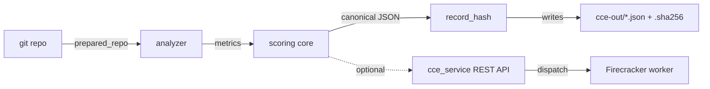

# CCE — Deterministic Code Complexity Engine

> A credit score for your code — the same commit always gets the same score, on any machine.

## What is this?

CCE gives your code a **complexity score** — a single number that tells you how hard your codebase is to understand and maintain. A lower score means cleaner, simpler code.

**What makes it different:** most code-quality tools give different answers on different machines, or change their mind between runs. CCE guarantees the exact same score for the exact same code, every time, on any computer. This means you can:

- **Trust the score** — it can't be manipulated or fudged.
- **Compare fairly** — two teams scoring the same commit get the same result.
- **Audit with confidence** — regulators or reviewers can reproduce the score themselves and get the identical answer.
- **Track over time** — if the score changes, your code changed. Nothing else.

CCE analyzes a repo, measures five complexity dimensions (cyclomatic, cognitive, nesting depth, function length, file length), and produces a report with a cryptographic fingerprint that proves the result hasn't been tampered with.

---

## Table of Contents

- [Sample Scores](#sample-scores)
- [Features](#features)
- [Architecture](#architecture)
- [Requirements](#requirements)
- [Installation](#installation)
- [Quick Start](#quick-start)
- [CLI Usage](#cli-usage)
- [Reproducible Container](#reproducible-container)
- [Configuration](#configuration)
- [Project Layout](#project-layout)
- [Development](#development)
- [Testing](#testing)
- [Production Service](#production-service)
- [CI](#ci)
- [Roadmap](#roadmap)
- [License](#license)

---

## Sample Scores

Scores range from 0 (minimal complexity) to 1 (maximum complexity). Here's how popular open-source Python projects stack up as of May 2026:

| Project | Score | Files Analyzed | Key Insight |
|---------|-------|----------------|-------------|
| **Flask** | **0.5954** | ~1,970 LOC | Cleanest of the three — moderate complexity with well-contained functions and shallow nesting. |
| **Requests** | **0.6370** | ~3,068 LOC | Similar structure to Flask but slightly higher cognitive load from more branching logic. |
| **FastAPI** | **0.8875** | ~7,304 LOC | Scores highest due to deeply nested parameter-parsing code and larger function bodies. |

<details>
<summary>Raw metric breakdown (click to expand)</summary>

| Project | Cyclomatic | Cognitive | Nesting Depth | Function Length | File Length |
|---------|------------|-----------|---------------|-----------------|-------------|
| Flask | 22 | 40 | 6 | 141 | 1,970 |
| Requests | 23 | 51 | 7 | 122 | 3,068 |
| FastAPI | 50 | 167 | 8 | 6,866 | 7,304 |

</details>

> **Each score is deterministic** — running `cce score` against the same commit on Linux, macOS, or ARM64 produces the identical `record_hash`. You can verify this yourself by cloning any of these repos and running `cce score --spec scoring-spec.yaml --repo <path> --mode repo`.

---

## Features

- **Deterministic scoring** — pure functions, no I/O, no clocks, no randomness, no hidden environment reads.
- **Decimal arithmetic** — uses `decimal.Decimal` with precision 28 and `ROUND_HALF_EVEN` to avoid floating-point drift.
- **Canonical JSON** — RFC 8785 (JCS) serialization ensures byte-identical output across platforms.
- **Tamper-evident record hash** — `sha256(spec_hash ‖ commit_sha ‖ canonical_metrics_json ‖ tool_digests_json)` ties the score to the exact spec and inputs.
- **Frozen normalisation cuts** — defined in `scoring-spec.yaml` so scores don't silently shift between releases.
- **100× determinism gate** — automated test asserts 100 sequential runs collapse to one hash.
- **GNU-compatible sidecars** — the `.sha256` sidecar works with stock `sha256sum -c`.
- **Network-isolated reproduction** — runs cleanly under `--network=none` for air-gapped verification.
- **Hostile-input hardening** — submodule traps, symlink escapes, and `protocol.file` are rejected.

## Architecture



The core pipeline is **`prepared_repo → analyze → score → write_outputs`**, emitted as OpenTelemetry spans. Each stage is independently unit-tested and free of hidden global state.

## Requirements

| Tool   | Version     | Notes                                          |
|--------|-------------|------------------------------------------------|
| Python | `>= 3.12`   | Pinned in `pyproject.toml`.                    |
| uv     | latest      | Used for env + lockfile management.            |
| git    | `>= 2.50.1` | Enforced at runtime via `scoring-spec.yaml`.   |
| Docker | any recent  | Required for reproducible / network-isolated runs. |

## Installation

```bash
git clone https://github.com/nsharwin/cce-poc.git
cd cce-poc

# Create the locked virtualenv and install
uv sync
```

Optional server-only extras (FastAPI / Postgres / ClickHouse):

```bash
uv pip install -e '.[cce-service]'
```

## Quick Start

```bash
# Score a local checkout against the bundled spec
uv run cce score --spec ./scoring-spec.yaml --repo /path/to/repo --mode repo

# Verify the produced sidecar with stock coreutils
cd cce-out && sha256sum -c <record_hash>.sha256
```

## CLI Usage

The CLI is installed as the `cce` console script.

### `cce score`

Score a working copy:

```bash
uv run cce score \
  --spec ./scoring-spec.yaml \
  --repo /path/to/repo \
  --mode repo
```

Score a specific commit:

```bash
uv run cce score \
  --spec ./scoring-spec.yaml \
  --repo /path/to/repo \
  --mode commit \
  --commit <40-hex-sha>
```

Outputs written under `./cce-out/`:

| File                     | Contents                                           |
|--------------------------|----------------------------------------------------|
| `<record_hash>.json`     | Canonical scoring record (RFC 8785).               |
| `<record_hash>.raw.json` | Raw analyzer output (canonical bytes).             |
| `<record_hash>.sha256`   | GNU coreutils sidecar — works with `sha256sum -c`. |

Stage timings are printed on **stderr**.

### `cce verify`

Recompute and check a record hash from its JSON:

```bash
uv run cce verify --record ./cce-out/<record_hash>.json
```

Verify via the sidecar:

```bash
uv run cce verify --sidecar ./cce-out/<record_hash>.sha256
```

> **Note:** `sha256sum -c` resolves filenames relative to the current directory, so `cd cce-out` first. `cce verify --sidecar <path>` has no such requirement.

## Reproducible Container

The repo ships a digest-pinned `Dockerfile` that enforces a specific base image, ensuring builds are bit-for-bit reproducible.

```bash
docker build -t cce:local .

docker run --rm \
  --network=none \
  -e CCE_REQUIRE_NETWORK_ISOLATED=1 \
  -v "$PWD:/work:ro" \
  -v "$PWD/cce-out:/work/cce-out" \
  cce:local \
  score --spec /work/scoring-spec.yaml \
        --repo /work/tests/fixtures/simple_python \
        --mode repo \
        --out /work/cce-out \
        --verify-digests false
```

To regenerate the base image digest after a Debian point release:

```bash
docker buildx imagetools inspect python:3.12-slim-bookworm
```

Then update **both** `Dockerfile` and `scoring-spec.yaml::worker_image` atomically in one commit.

## Configuration

All knobs live in `scoring-spec.yaml`:

| Key | Description |
|-----|-------------|
| `weights` | Per-metric blend weights. |
| `normalisation` | Piecewise-linear frozen cuts for all five metrics. |
| `rounding` | `decimal_places=4`, `mode=ROUND_HALF_EVEN`. |
| `pinned_tools` | SHA-256 digests for `tree_sitter_core`, grammars, `lizard`, `scc`. |
| `worker_image` | Pinned base image digest for Docker runs. |
| `git_min_version` | Minimum git version enforced at runtime. |
| `canonicalisation` | `RFC8785`. |
| `hash_algorithm` | `sha256`. |

Environment variables:

| Variable | Effect |
|----------|--------|
| `CCE_REQUIRE_NETWORK_ISOLATED=1` | Hard-fail if any outbound network is reachable. |

## Project Layout

```
.
├── src/
│   ├── cce/                 # Deterministic scoring core + CLI
│   │   ├── analyzer.py      # Built-in Python/TypeScript analyzer
│   │   ├── analyzers/
│   │   ├── canonical.py     # RFC 8785 helpers
│   │   ├── cli.py           # `cce` entrypoint
│   │   ├── git_ops.py       # Hardened git wrappers
│   │   ├── otel.py          # OpenTelemetry spans + Prometheus metrics
│   │   ├── runtime.py
│   │   ├── scoring.py       # Decimal-only scoring math
│   │   └── spec.py          # scoring-spec.yaml loader
│   └── cce_service/         # Optional REST service (FastAPI)
│       ├── api/             # HTTP routes
│       ├── auth/            # OAuth2 client-credentials JWT
│       ├── dispatch/        # Firecracker-per-job dispatcher
│       ├── storage/         # Postgres + ClickHouse adapters
│       ├── workers/         # Queue consumers
│       └── migrations/      # Alembic migrations
├── tests/                   # pytest suite + determinism gate + fixtures
├── ops/                     # SLOs, runbooks, observability config
├── scripts/                 # Maintenance helpers
├── scoring-spec.yaml        # Frozen scoring spec
├── Dockerfile               # Digest-pinned reproducible image
├── pyproject.toml           # Project + tooling config
├── requirements.lock.txt    # Hash-checked lockfile
└── REPRODUCING.md           # Protocol for independent hash verification
```

## Development

```bash
# Install dev tooling (pytest, ruff, hatchling)
uv sync

# Lint
uv run ruff check .

# Format check
uv run ruff format --check .
```

Source layout is `src/`-based with `pythonpath = ["src"]` configured in `pyproject.toml`.

## Testing

```bash
# Full unit + integration suite
uv run pytest -q

# 100× determinism gate
uv run pytest tests/determinism_100x.py -q
```

The suite covers scoring core, analyzer digests, CLI sidecars, git hardening, submodule traps, runtime checks, perf budgets, and the optional service layer (`tests/service/`).

## Production Service

`src/cce_service/` wraps the deterministic core as a REST API. Heavy dependencies (FastAPI, Postgres, ClickHouse, Redis, Firecracker) are imported lazily so the **core remains testable without infra**.

**Endpoints:**

```
POST /v1/scores               Submit a repo for scoring
GET  /v1/scores/{job_id}      Poll job status
GET  /v1/records/{record_hash} Fetch a completed scoring record
GET  /v1/audit?since=...       Audit log
GET  /healthz                  Health check
GET  /metrics                  Prometheus metrics
```

**Auth:** OAuth2 client-credentials JWT with scopes `score:write`, `records:read`, `audit:read`.

**Storage:** Postgres for jobs and audit log, ClickHouse for scoring records, in-memory adapters for tests.

**Workers:** Queue consumer → Firecracker dispatcher with a no-network rootfs for isolated scoring.

**Observability:** OpenTelemetry spans per pipeline stage + Prometheus counters/histograms.

## CI

GitHub Actions workflows enforce reproducibility and performance:

| Workflow | What it checks |
|----------|----------------|
| `poc-determinism.yml` | Hash comparison across Ubuntu x86_64, arm64, and macOS arm64 |
| `nightly-stability.yml` | 06:00 UTC cron — enforces a 7-day green streak |
| `perf-gate.yml` | 100k LoC must score in ≤ 90 s and ≤ 2 GB RAM |

## Roadmap

This release is the **deterministic scoring nucleus** plus a built-in source analyzer for Python and TypeScript. The one open milestone is an **external reproduction receipt** — a signed confirmation from an independent reviewer that they reproduced the same `record_hash` on their own machine. See [`REPRODUCING.md`](./REPRODUCING.md) for the protocol if you'd like to contribute one.

## License

[MIT](./LICENSE) — Copyright (c) 2026 nsharwin
