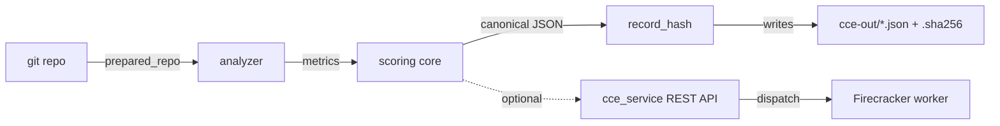

# CCE POC — Deterministic Code Complexity Engine

> A credit score for your code — the same commit always gets the same score, on any machine.

## What is this?

CCE gives your code a **complexity score** — a single number that tells you
how hard your codebase is to understand and maintain. A lower score means
cleaner, simpler code.

**What makes it different:** most code-quality tools give different answers
on different machines, or change their mind between runs. CCE guarantees the
exact same score for the exact same code, every time, on any computer. This
means you can:

- **Trust the score** — it can't be manipulated or fudged.
- **Compare fairly** — two teams scoring the same commit get the same result.
- **Audit with confidence** — regulators or reviewers can reproduce the score
  themselves and get the identical answer.
- **Track over time** — if the score changes, your code changed. Nothing else.

In practice, CCE analyzes a repo, measures five complexity dimensions
(cyclomatic, cognitive, nesting depth, function length, file length), and
produces a report with a cryptographic fingerprint that proves the result
hasn't been tampered with.

---

## Table of Contents

- [What is this?](#what-is-this)
- [Sample Scores](#sample-scores)
- [Features](#features)
- [Architecture](#architecture)
- [Requirements](#requirements)
- [Installation](#installation)
- [Quick Start](#quick-start)
- [CLI Usage](#cli-usage)
- [Reproducible Container](#reproducible-container)
- [Configuration](#configuration)
- [Project Layout](#project-layout)
- [Development](#development)
- [Testing](#testing)
- [Production Service](#production-service)
- [Operations](#operations)
- [CI Gates](#ci-gates)
- [Roadmap & Boundaries](#roadmap--boundaries)
- [License](#license)

---

## Sample Scores

Scores range from 0 (minimal complexity) to 1 (maximum complexity per the
spec's normalisation cuts). Here's how popular open-source Python projects
stack up as of May 2026:

| Project | Score | Files Analyzed | Key Insight |
|---------|-------|----------------|-------------|
| **Flask** | **0.5954** | ~1,970 LOC | Cleanest of the three — moderate complexity with well-contained functions and shallow nesting. |
| **Requests** | **0.6370** | ~3,068 LOC | Similar structure to Flask but slightly higher cognitive load from more branching logic. |
| **FastAPI** | **0.8875** | ~7,304 LOC | Scores highest due to deeply nested parameter-parsing code and larger function bodies. |

<details>
<summary>Raw metric breakdown (click to expand)</summary>

| Project | Cyclomatic | Cognitive | Nesting Depth | Function Length | File Length |
|---------|------------|-----------|---------------|-----------------|-------------|
| Flask | 22 | 40 | 6 | 141 | 1,970 |
| Requests | 23 | 51 | 7 | 122 | 3,068 |
| FastAPI | 50 | 167 | 8 | 6,866 | 7,304 |

</details>

> **Each score is deterministic** — running `cce score` against the same
> commit on Linux, macOS, or ARM64 produces the identical `record_hash`.
> You can verify this yourself by cloning any of these repos and running
> `cce score --spec scoring-spec.yaml --repo <path> --mode repo`.

---

## Features

- **Deterministic scoring core** — pure functions, no I/O, no clocks, no
  randomness, no environment reads (`PREQ-S-1`).
- **Decimal arithmetic** — `decimal.Decimal` with precision 28 and
  `ROUND_HALF_EVEN` (`PREQ-S-2`).
- **Canonical JSON** — RFC 8785 (JCS) via the pinned `rfc8785` package
  (`PREQ-S-3`).
- **Stable record hash** —
  `sha256(spec_hash ‖ commit_sha ‖ canonical_metrics_json ‖ tool_digests_json)`
  (`PREQ-S-4`).
- **Frozen normalisation cuts** — defined in `scoring-spec.yaml` (`PREQ-S-5`).
- **100× determinism gate** — `tests/determinism_100x.py` asserts 100
  sequential runs collapse to one hash (`PREQ-S-6`).
- **GNU-compatible sidecars** — `<record_hash>.sha256` is plain
  `sha256sum -c` format (`PREQ-D-3`).
- **Network-isolated reproduction** — runs cleanly under `--network=none`
  with `CCE_REQUIRE_NETWORK_ISOLATED=1` (`PREQ-X-3`).
- **Hostile-input hardening** — submodule traps, symlink escapes, and
  `protocol.file` are rejected (`PREQ-X-2`, `POC-GATE-6`).

## Architecture



The core pipeline is **`prepared_repo → analyze → score → write_outputs`**,
emitted as OpenTelemetry spans (`src/cce/otel.py`). Each stage is independently
unit-tested and free of hidden global state.

## Requirements

| Tool      | Version           | Notes                                             |
|-----------|-------------------|---------------------------------------------------|
| Python    | `>= 3.12`         | Pinned in `pyproject.toml`.                       |
| uv        | latest            | Used for env + lockfile management.               |
| git       | `>= 2.50.1`       | Enforced at runtime (`scoring-spec.yaml`).        |
| Docker    | any recent        | For reproducible / network-isolated runs.         |

## Installation

```bash
# Clone
git clone https://github.com/nsharwin/cce-poc.git
cd cce-poc

# Create the locked virtualenv and install
uv sync
```

Optional server-only extras (FastAPI / Postgres / ClickHouse):

```bash
uv pip install -e '.[cce-service]'
```

## Quick Start

```bash
# Score a local checkout against the bundled spec
uv run cce score --spec ./scoring-spec.yaml --repo /path/to/repo --mode repo

# Verify the produced sidecar with stock coreutils
cd cce-out && sha256sum -c <record_hash>.sha256
```

## CLI Usage

The CLI is installed as the `cce` console script (entry point: `cce.cli:entrypoint`).

### `cce score`

Score a working copy:

```bash
uv run cce score \
  --spec ./scoring-spec.yaml \
  --repo /path/to/repo \
  --mode repo
```

Score a specific commit:

```bash
uv run cce score \
  --spec ./scoring-spec.yaml \
  --repo /path/to/repo \
  --mode commit \
  --commit <40-hex-sha>
```

Outputs written under `./cce-out/`:

| File                          | Contents                                              |
|-------------------------------|-------------------------------------------------------|
| `<record_hash>.json`          | Canonical scoring record (RFC 8785).                  |
| `<record_hash>.raw.json`      | Raw analyzer output (canonical bytes).                |
| `<record_hash>.sha256`        | GNU coreutils sidecar — works with `sha256sum -c`.    |

Stage timings are printed on **stderr** (`PREQ-O-2`).

### `cce verify`

Recompute and check a record hash from its JSON:

```bash
uv run cce verify --record ./cce-out/<record_hash>.json
```

Verify via the sidecar (accepts both the new GNU and legacy `sha256:<hex>`
formats):

```bash
uv run cce verify --sidecar ./cce-out/<record_hash>.sha256
```

> **Note:** `sha256sum -c` resolves filenames relative to the current
> directory, so `cd cce-out` first. `cce verify --sidecar <path>` has no
> such requirement.

## Reproducible Container

The repo ships a **digest-pinned** `Dockerfile`
(`python:3.12-slim-bookworm@sha256:93ab4b7f…`) satisfying `PREQ-A-2`,
`PREQ-A-3`, and `PREQ-X-1` (`git >= 2.50.1` from `bookworm-backports`).

```bash
docker build -t cce-poc:local .

docker run --rm \
  --network=none \
  -e CCE_REQUIRE_NETWORK_ISOLATED=1 \
  -v "$PWD:/work:ro" \
  -v "$PWD/cce-out:/work/cce-out" \
  cce-poc:local \
  score --spec /work/scoring-spec.yaml \
        --repo /work/tests/fixtures/simple_python \
        --mode repo \
        --out /work/cce-out \
        --verify-digests false
```

To regenerate the base image digest after a Debian point release:

```bash
docker buildx imagetools inspect python:3.12-slim-bookworm
```

Then update **both** `Dockerfile` and `scoring-spec.yaml::worker_image`
atomically in one commit.

## Configuration

All knobs live in `scoring-spec.yaml`:

- `weights` — per-metric blend weights.
- `normalisation` — piecewise-linear frozen cuts (cyclomatic, cognitive,
  nesting depth, function length, file length).
- `rounding` — `decimal_places=4`, `mode=ROUND_HALF_EVEN`.
- `pinned_tools` — sha256 digests for `tree_sitter_core`, grammars,
  `lizard`, `scc`.
- `worker_image` — pinned base image digest.
- `git_min_version` — minimum git version enforced at runtime.
- `canonicalisation` — `RFC8785`.
- `hash_algorithm` — `sha256`.

Environment variables consumed by the CLI/runtime:

| Variable                          | Effect                                                  |
|-----------------------------------|---------------------------------------------------------|
| `CCE_REQUIRE_NETWORK_ISOLATED=1`  | Hard-fail if any outbound network is reachable.         |

## Project Layout

```
.
├── src/
│   ├── cce/                 # Deterministic scoring core + CLI
│   │   ├── analyzer.py      # Built-in Python/TypeScript analyzer
│   │   ├── analyzers/
│   │   ├── canonical.py     # RFC 8785 helpers
│   │   ├── cli.py           # `cce` entrypoint
│   │   ├── git_ops.py       # Hardened git wrappers
│   │   ├── otel.py          # Stage spans + Prometheus metrics
│   │   ├── runtime.py
│   │   ├── scoring.py       # Decimal-only scoring math
│   │   └── spec.py          # `scoring-spec.yaml` loader
│   └── cce_service/         # Optional REST service (FastAPI)
│       ├── api/             # HTTP routes
│       ├── auth/            # OAuth2 client-credentials JWT
│       ├── dispatch/        # Firecracker-per-job dispatcher
│       ├── storage/         # Postgres + ClickHouse adapters
│       ├── workers/         # Queue consumers
│       └── migrations/      # Alembic migrations
├── tests/                   # pytest suite + determinism gate + fixtures
├── docs/                    # PRD, plans, reproductions
├── ops/                     # SLOs, runbooks, observability, firecracker
├── scripts/                 # Maintenance helpers (digests, grammars)
├── scoring-spec.yaml        # Frozen scoring spec
├── Dockerfile               # Digest-pinned reproducible image
├── pyproject.toml           # Project + tooling config
├── requirements.lock.txt    # Hash-checked lockfile
├── alembic.ini              # Migrations config (service)
└── DEFERRED.md              # Tracked gaps vs full PRD
```

## Development

```bash
# Install dev tooling (pytest, ruff, hatchling)
uv sync

# Lint
uv run ruff check .

# Format check
uv run ruff format --check .
```

Source layout is `src/`-based with `pythonpath = ["src"]` configured in
`pyproject.toml`.

## Testing

```bash
# Full unit + integration suite
uv run pytest -q

# 100× determinism gate (PREQ-S-6)
uv run pytest tests/determinism_100x.py -q
```

The suite covers: scoring core, analyzer digests, CLI sidecars, git
hardening, submodule traps, runtime checks, perf budgets, and the
optional service layer (`tests/service/`).

## Production Service

`src/cce_service/` wraps the deterministic core as a production-grade
REST API. Heavy dependencies (FastAPI, Postgres, ClickHouse, Redis,
Firecracker) are imported lazily so the **core remains testable without
infra**.

- **API** (`src/cce_service/api/`):
  - `POST /v1/scores`
  - `GET  /v1/scores/{job_id}`
  - `GET  /v1/records/{record_hash}`
  - `GET  /v1/audit?since=...`
  - `/healthz`, `/metrics`
- **AuthN/Z** (`src/cce_service/auth/`): OAuth2 client-credentials JWT
  with scopes `score:write`, `records:read`, `audit:read`.
- **Storage** (`src/cce_service/storage/`): Postgres for jobs/audit
  (`REQ-D-5`), ClickHouse for records (`REQ-D-2`), in-memory adapters
  for tests.
- **Worker pool** (`src/cce_service/{workers,dispatch}/`): queue
  consumer → Firecracker dispatcher with a no-network rootfs
  (`PREQ-X-4`).
- **Observability** (`src/cce/otel.py`): OpenTelemetry spans per stage
  + Prometheus counters/histograms.

## Operations

Operational artifacts under `ops/`:

- `ops/slo.md` — availability, score-latency, record-read, determinism,
  isolation SLOs with Prometheus SLIs.
- `ops/rollback.md` — blue/green digest-pinned rollback procedure.
- `ops/runbooks/` — `api-5xx`, `worker-stuck`, `clickhouse-lag`,
  `hash-mismatch`, `firecracker-boot-fail`.
- `ops/observability/` — Alertmanager rules, Grafana dashboard, OTel
  collector config.
- `ops/firecracker/` — `jailer.json`, `kernel.config`, `rootfs.build.sh`.
- `ops/nightly-streak.json` — 7-day green-streak tracker for
  `nightly-stability.yml` (`POC-GATE-3`).

## CI Gates

GitHub Actions workflows enforce reproducibility and budgets:

- `.github/workflows/poc-determinism.yml` — matrix hash-compare across
  Ubuntu x86_64 + arm64 + macOS arm64 (`PREQ-S-7`).
- `.github/workflows/nightly-stability.yml` — 06:00 UTC cron; enforces
  the 7-day green streak (`POC-GATE-3`).
- `.github/workflows/perf-gate.yml` — 100k LoC ≤ 90 s / ≤ 2 GB
  (`POC-GATE-8`).

## Roadmap & Boundaries

This release is the **deterministic scoring nucleus** plus a deterministic
built-in source analyzer for Python and TypeScript fixtures. It does **not**
yet claim final analyzer equivalence with pinned `tree-sitter`, `lizard`, or
`scc` binaries — those gaps are tracked in [`DEFERRED.md`](./DEFERRED.md).

## License

This is a proof of concept. See repository metadata for licensing terms.
