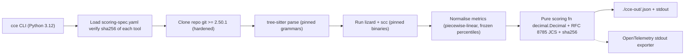

# POC PRD — CCE Deterministic Scoring (Proof of Concept)

> 🤖 **LLM-consumable POC PRD.** Narrow, time-boxed proof for the deterministic complexity score from [PRD — Deterministic Code Complexity Scoring Platform](https://www.notion.so/PRD-Deterministic-Code-Complexity-Scoring-Platform-183fe7408b7a405998a1475ac8c63f0a?pvs=21). All requirement IDs are POC-scoped (`PREQ-*`) and trace back to the parent PRD's `REQ-*`. RFC 2119 keywords are normative. Do not paraphrase IDs — quote verbatim.

```yaml
product: Code Complexity Engine (CCE)
doc_type: POC_PRD
doc_version: 0.1.0
parent_prd:
  title: "PRD — Deterministic Code Complexity Scoring Platform"
  url: "https://www.notion.so/183fe7408b7a405998a1475ac8c63f0a"
owner: Sharwin Nandhakumar
workspace: TuraHire
status: draft
last_updated: 2026-05-24
rfc2119: true
time_box_weeks: 3
audience:
  - planning_llm
  - coding_agent
  - human_engineer
intent: "Prove ONE thing: same inputs + pinned spec + pinned tools ⇒ byte-identical score across machines and runs."
```

## 1. POC Thesis (the one falsifiable claim)

```yaml
id: THESIS
claim: >
  Given (a) a fixed scoring-spec.yaml with sha256-pinned analyzer digests and
  (b) a git commit SHA, the POC will produce a `record_hash` (sha256 over the
  canonical JSON score record) that is BYTE-IDENTICAL across:
    - 100 sequential runs on the same machine, AND
    - 3 different machines (Linux x86_64, Linux arm64, macOS arm64), AND
    - 2 different CI runners (GitHub Actions, local Docker).
falsification: "Any single divergent record_hash across the matrix above fails the POC."
out_of_scope_for_poc:
  - Production scale, multi-tenancy, RBAC, billing
  - LLM narrative lane (deferred to PRD M-4)
  - PR Check / GitHub App / webhook ingestion
  - Hotspot/churn engine, RAG, vector DB
  - SLSA L3 provenance and cosign signing (manual checksum file only)
  - Firecracker microVM isolation (use Docker for POC; document the gap)
  - Postgres / ClickHouse / S3 storage (write JSON files to disk + git)
  - Observability stack (stdout logs + basic OpenTelemetry stdout exporter)
```

## 2. POC Scope Boundary (hard limits)

```yaml
languages:
  - python
  - typescript
repo_size_cap: "≤ 100k LoC"
modes_supported:
  - repo   # full HEAD scoring
  - commit # single commit scoring
modes_deferred:
  - pr     # delta scoring (deferred to PRD M-3)
metrics_in_poc:
  - cyclomatic_complexity
  - cognitive_complexity
  - function_length_lines
  - file_length_lines
  - nesting_depth
metrics_deferred:
  - churn_hotspot         # needs git log history mining
  - dependency_coupling   # needs import graph analyzer
  - duplication           # needs jscpd/CPD wiring
analyzers_in_poc:
  - tree-sitter (core + python grammar + typescript grammar) # pinned by commit SHA
  - lizard (cyclomatic / cognitive / nesting / function length) # pinned by sha256
  - scc (file length + LoC) # pinned by sha256
interfaces:
  - CLI only: `cce score --spec ./scoring-spec.yaml --repo ./path-or-url --mode repo|commit --commit <sha>`
  - Output: JSON to stdout + `./cce-out/<record_hash>.json` written to disk
no_network_after_clone: true
llm_lane_in_poc: "disabled"
```

## 3. Personas (POC-relevant only)

```yaml
personas:
  - id: P-POC-1
    role: "Founding engineer (Sharwin)"
    need: "Run `cce score` on 3 sample repos, get identical record_hash 100/100 times."
  - id: P-POC-2
    role: "Design partner reviewer"
    need: "Independently reproduce the score on their laptop from spec + repo + tool digests."
```

## 4. POC Architecture (minimal)



## 5. Functional Requirements (POC)

### 5.1 Determinism Core (the only thing we are proving)

```yaml
- id: PREQ-S-1
  traces_to: REQ-S-1
  statement: "Scoring function MUST be a pure function with no I/O, no clocks, no randomness, no env reads."
  priority: P0
- id: PREQ-S-2
  traces_to: REQ-S-2
  statement: "All arithmetic MUST use python decimal.Decimal with getcontext().prec = 28, rounding=ROUND_HALF_EVEN. Float MUST NOT appear in the scoring path."
  priority: P0
- id: PREQ-S-3
  traces_to: REQ-S-3
  statement: "Metric JSON MUST be canonicalised per RFC 8785 (JCS) before hashing. Use `rfc8785` Python package, pinned."
  priority: P0
- id: PREQ-S-4
  traces_to: REQ-S-4
  statement: "record_hash = sha256(spec_hash || commit_sha || canonical_metrics_json || tool_digests_json). All concatenations occur as bytes; no separators."
  priority: P0
- id: PREQ-S-5
  traces_to: REQ-S-5
  statement: "Normalisation cuts MUST be defined in scoring-spec.yaml and used as-is. No live percentile computation in POC."
  priority: P0
- id: PREQ-S-6
  traces_to: REQ-S-7
  statement: "determinism-100x test MUST pass: 100 sequential runs on the same machine produce 1 unique record_hash."
  priority: P0
  acceptance: "`pytest tests/determinism_100x.py` green."
- id: PREQ-S-7
  traces_to: REQ-S-7
  statement: "cross-machine test MUST pass: record_hash is identical on Linux x86_64, Linux arm64, macOS arm64 for the golden corpus."
  priority: P0
  acceptance: "GitHub Actions matrix CI green for all 3 OS targets."
```

### 5.2 Analyzer Pinning (POC subset)

```yaml
- id: PREQ-A-1
  traces_to: REQ-A-1
  statement: "tree-sitter core, tree-sitter-python grammar, tree-sitter-typescript grammar, lizard, scc MUST each be pinned by sha256 in scoring-spec.yaml and verified before use."
  priority: P0
- id: PREQ-A-2
  traces_to: REQ-A-2
  statement: "POC worker image MUST be a Dockerfile with FROM image pinned by digest (not tag) and all apt/pip installs pinned by version + hash."
  priority: P0
- id: PREQ-A-3
  traces_to: REQ-A-3
  statement: "After the build phase, the runtime container MUST run with --network=none. Any analyzer that needs network access is a POC blocker."
  priority: P0
- id: PREQ-A-4
  traces_to: REQ-A-4
  statement: "Grammar-stability check MUST run in CI: parse the golden corpus and assert byte-identical node spans vs the previous run's golden file."
  priority: P1
```

### 5.3 Git Safety (minimum viable hardening)

```yaml
- id: PREQ-X-1
  traces_to: REQ-X-2
  statement: "Git client used in the POC container MUST be ≥ 2.50.1."
  priority: P0
- id: PREQ-X-2
  traces_to: REQ-X-3
  statement: "Clone MUST use --no-local --depth=1 --filter=blob:none --no-checkout, then `git -c protocol.file.allow=never -c core.symlinks=false -c submodule.recurse=false checkout <sha>`. Submodules MUST NOT be recursed."
  priority: P0
- id: PREQ-X-3
  traces_to: REQ-X-5
  statement: "After clone phase, container network MUST be disabled (--network=none). Verified by attempting `curl -m2 https://example.com` and asserting failure in CI."
  priority: P0
- id: PREQ-X-4
  traces_to: REQ-X-1
  statement: "POC accepts Docker isolation (not Firecracker). The gap MUST be documented in DEFERRED.md."
  priority: P1
```

### 5.4 Storage (filesystem only)

```yaml
- id: PREQ-D-1
  traces_to: REQ-D-1
  statement: "Score records MUST be written to ./cce-out/<record_hash>.json. No database in POC."
  priority: P0
- id: PREQ-D-2
  traces_to: REQ-D-3
  statement: "Raw analyzer outputs MUST be written to ./cce-out/<record_hash>.raw.json for reproducibility audit."
  priority: P0
- id: PREQ-D-3
  traces_to: REQ-D-4
  statement: "Each score record MUST have a sibling ./cce-out/<record_hash>.sha256 file containing the sha256 of the JSON for tamper detection. Cosign signing is deferred."
  priority: P1
```

### 5.5 Observability (minimal)

```yaml
- id: PREQ-O-1
  traces_to: REQ-O-1
  statement: "CLI MUST emit OpenTelemetry traces to stdout (otel SDK stdout exporter). Span names: cce.load_spec, cce.clone, cce.parse, cce.measure, cce.score."
  priority: P1
- id: PREQ-O-2
  traces_to: REQ-O-3
  statement: "CLI MUST print wall time per stage and total in human-readable form on stderr."
  priority: P0
```

## 6. Non-Functional Requirements (POC)

```yaml
performance:
  - id: PNFR-PERF-1
    metric: "End-to-end score latency on 100k LoC repo (cold)"
    target: "≤ 5 minutes wall time on M2 Pro / equivalent x86_64"
  - id: PNFR-PERF-2
    metric: "End-to-end score latency on 10k LoC repo (cold)"
    target: "≤ 60 seconds wall time"
portability:
  - id: PNFR-PORT-1
    target: "Runs on Linux x86_64, Linux arm64, macOS arm64 with identical record_hash"
security:
  - id: PNFR-SEC-1
    target: "No network egress after clone phase; verified in CI"
  - id: PNFR-SEC-2
    target: "No submodule recursion; verified by submodule-trap test repo"
reproducibility:
  - id: PNFR-REPRO-1
    target: "100/100 sequential runs → 1 unique record_hash"
  - id: PNFR-REPRO-2
    target: "3/3 OS targets → 1 unique record_hash for each fixture"
```

## 7. POC Acceptance Criteria (binary pass/fail)

```yaml
poc_gates:
  - id: POC-GATE-1
    check: "determinism-100x test green locally"
  - id: POC-GATE-2
    check: "GitHub Actions matrix (linux-x86_64, linux-arm64, macos-arm64) all green on same record_hash for each golden fixture"
  - id: POC-GATE-3
    check: "Golden corpus (3 fixture repos: small python, small ts, mid 100k LoC) all produce stable record_hash across 7 consecutive days of nightly runs"
  - id: POC-GATE-4
    check: "External reviewer (design partner) runs `cce score` on their machine from same spec and gets matching record_hash"
  - id: POC-GATE-5
    check: "Network-isolation test passes (container has --network=none after clone; curl to internet fails)"
  - id: POC-GATE-6
    check: "Submodule-trap fixture (malicious .gitmodules) is rejected or safely no-ops; CCE-CVE-25 check green"
  - id: POC-GATE-7
    check: "Grammar-stability CI green: node spans byte-identical to previous golden"
  - id: POC-GATE-8
    check: "PNFR-PERF-1 met on 100k LoC fixture"
```

## 8. POC Build Order (3 weeks)

```yaml
milestones:
  - id: POC-M-1
    days: "1–3"
    deliverable: "Repo scaffold (Python 3.12 + uv + ruff + pytest). scoring-spec.yaml v0.1.0 with pinned digests for tree-sitter-core, tree-sitter-python, tree-sitter-typescript, lizard, scc."
  - id: POC-M-2
    days: "4–6"
    deliverable: "Pure scoring function (decimal.Decimal, frozen percentile cuts, RFC 8785 canonicalisation, sha256 record_hash). Unit tests on synthetic metric inputs."
  - id: POC-M-3
    days: "7–9"
    deliverable: "Analyzer wiring (tree-sitter parse + lizard + scc) with digest verification on startup. JSON output contract finalised."
  - id: POC-M-4
    days: "10–12"
    deliverable: "Dockerfile (pinned base + apt+pip with hashes). --network=none runtime. Hardened git clone. Submodule-trap fixture + test."
  - id: POC-M-5
    days: "13–15"
    deliverable: "determinism-100x test + GitHub Actions matrix CI (linux-x86_64, linux-arm64, macos-arm64). Golden corpus (3 fixtures) frozen."
  - id: POC-M-6
    days: "16–18"
    deliverable: "Grammar-stability CI test. OpenTelemetry stdout exporter. README with reproduction steps for an external reviewer."
  - id: POC-M-7
    days: "19–21"
    deliverable: "7-day nightly stability run. External reviewer reproduction. DEFERRED.md cataloguing every PRD requirement NOT in POC. Demo recording."
```

## 9. POC Spec Files (minimal)

### 9.1 `scoring-spec.yaml` (POC v0.1.0)

```yaml
spec_version: 0.1.0
spec_hash: "sha256:<computed-at-build>"
languages:
  - python
  - typescript
weights:
  cyclomatic: "0.30"
  cognitive: "0.30"
  nesting_depth: "0.15"
  file_length: "0.10"
  function_length: "0.15"
normalisation:
  method: "piecewise_linear_frozen_cuts"
  cyclomatic:
    cuts: ["5", "10", "20", "50"]
    normalised: ["0.00", "0.25", "0.50", "0.75", "1.00"]
  cognitive:
    cuts: ["5", "15", "30", "60"]
    normalised: ["0.00", "0.25", "0.50", "0.75", "1.00"]
  nesting_depth:
    cuts: ["2", "4", "6", "8"]
    normalised: ["0.00", "0.25", "0.50", "0.75", "1.00"]
  function_length:
    cuts: ["20", "50", "100", "200"]
    normalised: ["0.00", "0.25", "0.50", "0.75", "1.00"]
  file_length:
    cuts: ["100", "300", "600", "1000"]
    normalised: ["0.00", "0.25", "0.50", "0.75", "1.00"]
rounding:
  decimal_places: 4
  mode: ROUND_HALF_EVEN
pinned_tools:
  tree_sitter_core: "sha256:<digest>"
  grammars:
    python: "sha256:<digest>"
    typescript: "sha256:<digest>"
  lizard: "sha256:<digest>"
  scc: "sha256:<digest>"
worker_image: "sha256:<digest>"
git_min_version: "2.50.1"
canonicalisation: "RFC8785"
hash_algorithm: "sha256"
```

### 9.2 POC Score Record (canonical shape)

```json
{
  "poc": true,
  "spec_version": "0.1.0",
  "spec_hash": "sha256:<hex>",
  "mode": "repo",
  "vcs": "git",
  "repo": "local-or-url",
  "commit_sha": "<40-hex>",
  "computed_at": "<ISO8601, EXCLUDED from record_hash>",
  "tool_digests": {
    "tree_sitter_core": "sha256:...",
    "tree_sitter_python": "sha256:...",
    "tree_sitter_typescript": "sha256:...",
    "lizard": "sha256:...",
    "scc": "sha256:..."
  },
  "metrics": {
    "cyclomatic":      { "raw": "42",  "normalised": "0.6500" },
    "cognitive":       { "raw": "78",  "normalised": "0.8000" },
    "nesting_depth":   { "raw": "5",   "normalised": "0.5000" },
    "function_length": { "raw": "120", "normalised": "0.7500" },
    "file_length":     { "raw": "450", "normalised": "0.5000" }
  },
  "score": "0.6675",
  "score_decimal_places": 4,
  "record_hash": "sha256:<hex>"
}
```

### 9.3 CLI Contract

```yaml
commands:
  - name: cce score
    args:
      --spec: "path to scoring-spec.yaml (required)"
      --repo: "local path or https git URL (required)"
      --mode: "repo|commit (default: repo)"
      --commit: "40-hex SHA (required if --mode=commit)"
      --out: "output directory (default: ./cce-out)"
      --verify-digests: "true|false (default: true)"
    exit_codes:
      0: "success; record_hash printed to stdout"
      10: "spec validation failure"
      11: "digest verification failure"
      12: "clone or git safety failure"
      13: "analyzer failure"
      14: "scoring failure"
  - name: cce verify
    args:
      --record: "path to ./cce-out/<record_hash>.json (required)"
    behaviour: "Recompute record_hash from canonical JSON and assert equality. Exit 0 on match."
```

## 10. POC Risks

```yaml
risks:
  - id: POC-RISK-1
    risk: "tree-sitter grammar produces different node IDs on different platforms."
    mitigation: "Add grammar-stability test (PREQ-A-4) on day 1. If it fails, freeze to source-text-only metrics; defer span-based features."
  - id: POC-RISK-2
    risk: "lizard / scc output ordering varies by filesystem iteration order."
    mitigation: "Sort all per-file results lexicographically by relative path before canonicalisation."
  - id: POC-RISK-3
    risk: "Decimal context not enforced consistently → silent precision drift."
    mitigation: "Wrap scoring fn in a context manager that sets prec/rounding and asserts on exit."
  - id: POC-RISK-4
    risk: "GitHub Actions arm64 runner unavailable or flaky."
    mitigation: "Fall back to QEMU-emulated arm64 for the cross-arch determinism test if native arm64 runner is unstable."
  - id: POC-RISK-5
    risk: "Scope creep: requests for LLM lane, PR Check, or hotspot during POC."
    mitigation: "DEFERRED.md is the only acceptable response. Add to PRD M-3 / M-4 / M-5 instead."
```

## 11. POC Deliverables Checklist

```yaml
deliverables:
  - "git repo: cce-poc (Python 3.12, uv, ruff, pytest)"
  - "cce CLI binary (uv tool install .)"
  - "Dockerfile (digest-pinned base, hash-pinned deps)"
  - "scoring-spec.yaml v0.1.0 with real sha256 digests filled in"
  - "3 golden fixture repos under tests/fixtures/ with frozen expected record_hash files"
  - "tests/determinism_100x.py"
  - "tests/grammar_stability.py"
  - "tests/network_isolation.py"
  - "tests/submodule_trap.py"
  - ".github/workflows/poc-determinism.yml (matrix CI)"
  - "DEFERRED.md (every PRD requirement NOT in POC, with traces_to)"
  - "README.md with end-to-end external-reviewer reproduction steps"
  - "DEMO.md + recorded demo for design partner review"
```

## 12. POC → PRD Traceability Map

```yaml
traceability:
  PREQ-S-1: REQ-S-1
  PREQ-S-2: REQ-S-2
  PREQ-S-3: REQ-S-3
  PREQ-S-4: REQ-S-4
  PREQ-S-5: REQ-S-5
  PREQ-S-6: REQ-S-7
  PREQ-S-7: REQ-S-7
  PREQ-A-1: REQ-A-1
  PREQ-A-2: REQ-A-2
  PREQ-A-3: REQ-A-3
  PREQ-A-4: REQ-A-4
  PREQ-X-1: REQ-X-2
  PREQ-X-2: REQ-X-3
  PREQ-X-3: REQ-X-5
  PREQ-X-4: REQ-X-1
  PREQ-D-1: REQ-D-1
  PREQ-D-2: REQ-D-3
  PREQ-D-3: REQ-D-4
  PREQ-O-1: REQ-O-1
  PREQ-O-2: REQ-O-3
deferred_from_prd:
  - REQ-S-6   # PR delta scoring
  - REQ-L-*   # entire LLM lane
  - REQ-I-*   # GitHub App / GitLab / Bitbucket integrations
  - REQ-D-2   # ClickHouse
  - REQ-D-5   # Audit log export
  - REQ-O-2   # distributed trace propagation
  - All NFR-SCALE-*, NFR-AVAIL-*, NFR-COMP-*
```

## 13. LLM Agent Instructions (POC implementer guide)

> 🧭
>
> 1. When implementing any `PREQ-*`, quote the ID verbatim in the PR description and link the line of code or test that satisfies it.
> 2. Float types are BANNED in the scoring path. Use `decimal.Decimal` with the context set at module import.
> 3. If a deterministic guarantee CANNOT be met for a metric on a platform, REMOVE the metric from the POC and record the removal in `DEFERRED.md`. Do not weaken the determinism gate.
> 4. Do NOT add network calls anywhere after `cce.clone` span ends. CI will fail if egress is reachable.
> 5. Do NOT introduce any LLM call in the POC. The LLM lane is out of scope.
> 6. Sort all collections before canonicalisation. Filesystem iteration order is not deterministic.
> 7. If a PRD requirement is tempting but not in the POC scope, add a one-line entry to `DEFERRED.md` with the `REQ-*` ID and stop.
> 8. Pin everything by digest, not by tag or version. Tags can be moved; digests cannot.

## References

- [PRD — Deterministic Code Complexity Scoring Platform](https://www.notion.so/PRD-Deterministic-Code-Complexity-Scoring-Platform-183fe7408b7a405998a1475ac8c63f0a?pvs=21)
